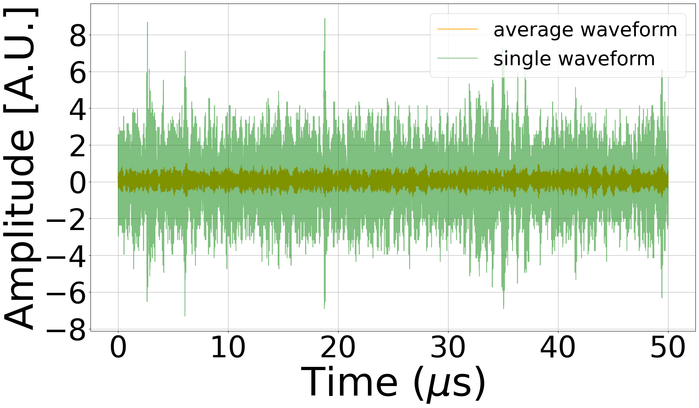
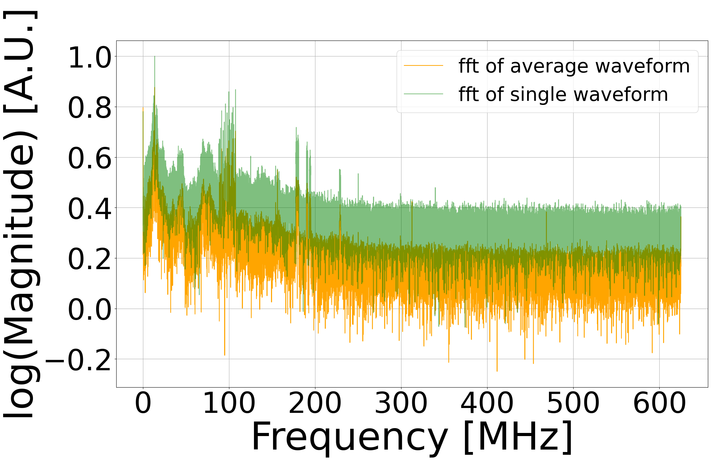
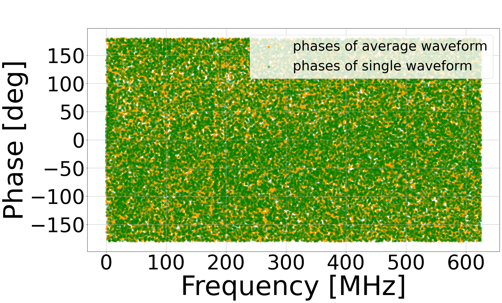
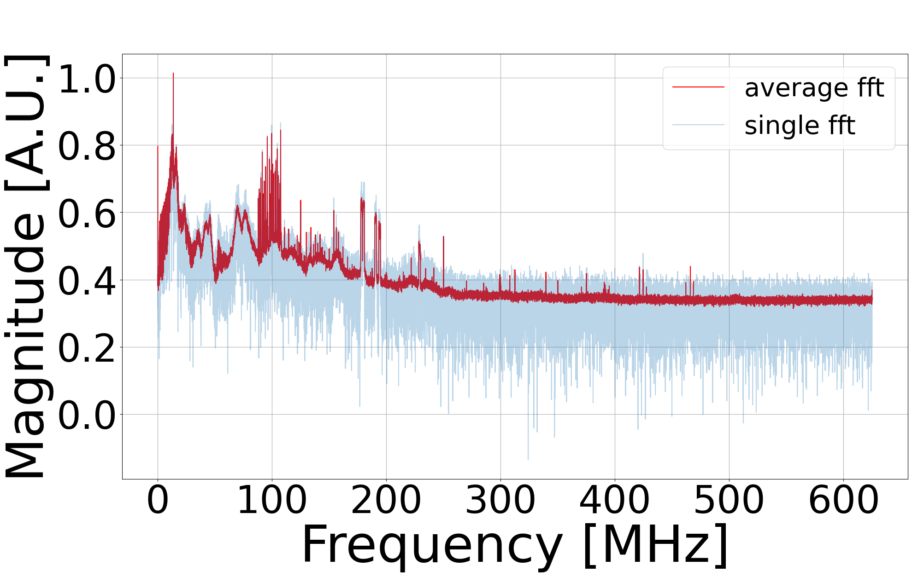
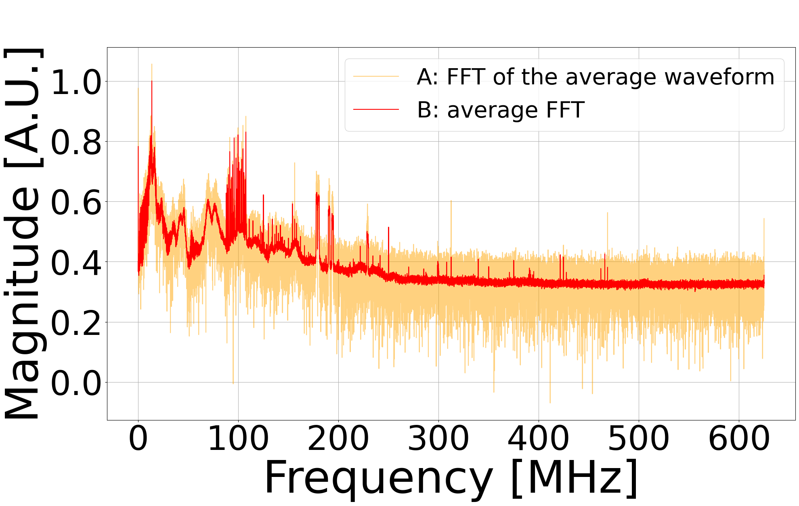

The data acquisition system provides by default 64 waveforms consecutive in time. In priciple there are two methods for combining these measurements.

> **Naming convetions:** If the average is computed in time domain the average of the waveforms will be referred to as the average waveform, if the average is computed in frequency domain the average of the spectra will be referred to as the average FFT.
The term reconstructed refers to a waveform (or a spectrum) that is the inverse Fourier transform (or the Fourier transform) of an average in frequency (or time) domain.

## Method A
Computing the average of 64 waveforms $\longrightarrow$ FFT and phases of the reconstructed spectrum.

Source code: [avg_wf_vs_avg_fft](avg_wf_VS_avg_fft.ipynb)

Source code: [avg_wf_vs_avg_fft_phase](avg_wf_VS_avg_fft_phase.ipynb) \
With this method you can see a chaotic phase composition in the averaged signal.

## Method B
Computing separetly the FFT of each waveform $\longrightarrow$ average FFT and average phases.\
Note that the average FFT is calculated by averaging the absolute values, but the phases must calculated before executing np.abs(Y), otherwise we would lose the phase information.

Source code: [avg_wf_vs_avg_fft](avg_wf_VS_avg_fft.ipynb)

Source code: [avg_wf_vs_avg_phase](avg_wf_VS_avg_fft_phase.ipynb) \
With this method you can see a tendency towards an average phase of 0 degrees.

## Comparison A VS B

Source code: [avg_wf_vs_avg_fft](avg_wf_VS_avg_fft.ipynb)

Source code: [avg_wf_vs_avg_phase](avg_wf_VS_avg_fft_phase.ipynb)
