Each algorithm has been tested both with a simple input and a single waveform to make sure any mistakes were carried into the implemetation. Studying how the same algorithms operate on multiple waveforms required multiple attempts since the computational steps are more and interchangeable.

The **noise waveform** is the difference between 
 - the original waveform $\longleftarrow$ either the average or the reconstructed one  from the average of the spectra, depending on in which domain the average has been done to get the filtered waveform,
- and the filtered waveform $\longleftarrow$ the output of the filtering attempt.

> **Testing technique:** The noise waveform is compared to
> - the **expected noise waveform** $\longleftarrow$ a cosine wave with amplitude equal to the noise waveform's amplitude, frequency of the target component, phase depending on how the phase information is carried through that specific attempt.

# First filtering algorithm
Consists into suppressing the unwanted component in frequency domain.

- Attempt one. Averaging the magnitudes $\longrightarrow$ filtering the average magnitude $\longrightarrow$ IFFT
  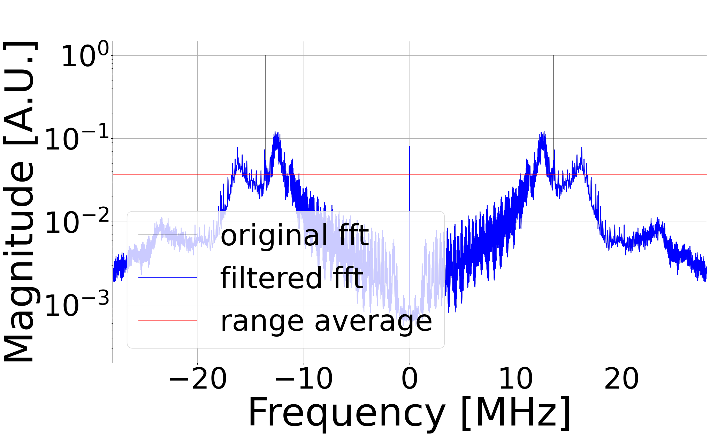
  The expected noise waveform has a phase equal to the average of the phases of that component before filtering.
  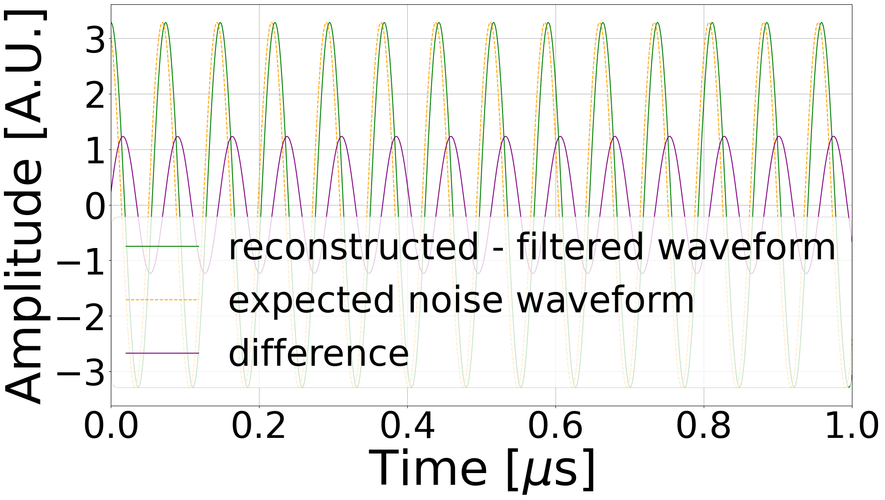
- Attempt two. Filtering 64 magnitudes $\longrightarrow$ averaging the filtered magnitudes $\longrightarrow$ IFFT
  The expected noise waveform and the result are the same as attempt 2 since avraging in frequency domain before or after filtering doesn't change the outcome.
- Attempt three. Filtering 64 magnitudes $\longrightarrow$ 64 IFFTs $\longrightarrow$ average the filtered waveforms
  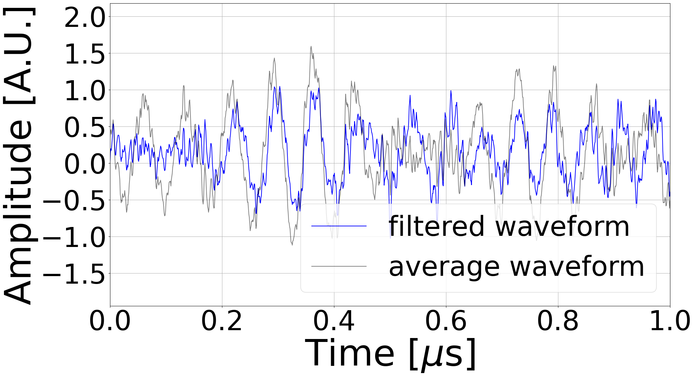
  The expected noise waveform has a phase equal to the average of the phases of that component before filtering.
  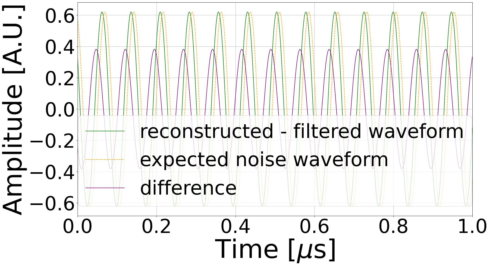
- Attempt four. Filtering 64 spectra (complex) $\longrightarrow$ averaging the filtered spectra (complex) $\longrightarrow$ IFFT
  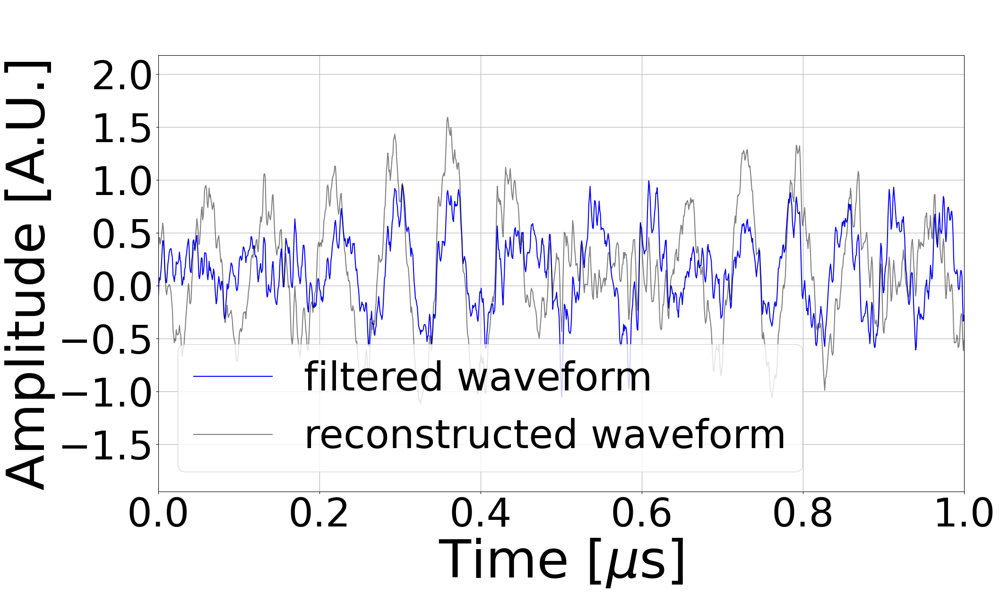
  The expected noise waveform has a phase equal to the phase of the average of that component's measurements before filtering.
  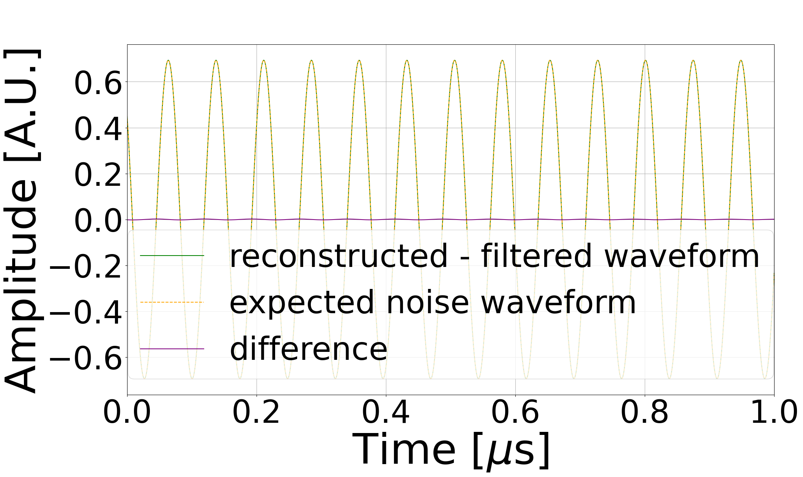
 ATTENTION: This attempt refers to an expected noise waveform with an incorrectly-retrieved phase. Therefore, even though the noise waveform obtained seems satisfactory, it is probably being compared to a non-existent component.
  Below is represented the comparison between the spread of the average of the phases and the phases of the average spectrum.
  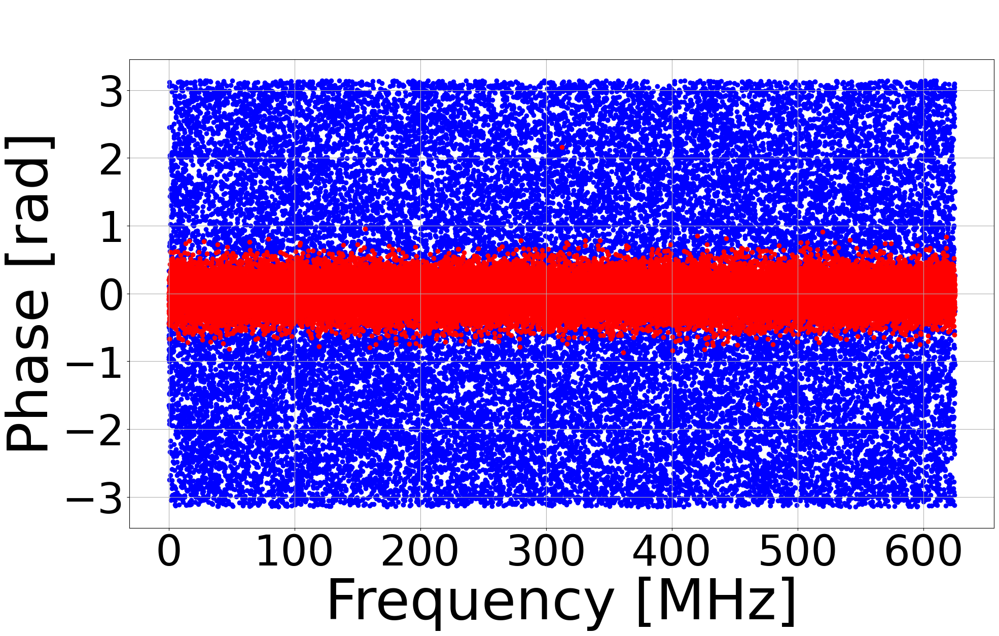
  This plots show how the first method of retrieving the phase information reduces the influence of uncorrelated components, yielding a more accurate phase estimation.

# Second filtering algorithm
Involves subtracting the noise waveform from the original one in time domain. The noise waveform can be retrieved in different ways.
- Attempt one. Averaging the magnitudes $\longrightarrow$ zeroing the average magnitude $\longrightarrow$ IFFT
  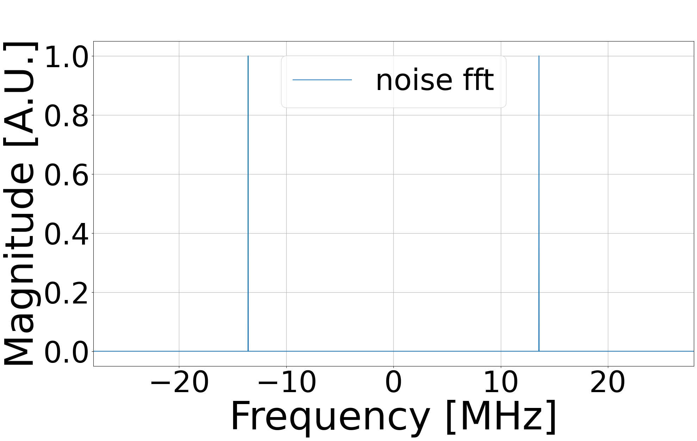
  The expected noise waveform has a phase equal to the average of the phases of that component before filtering.
  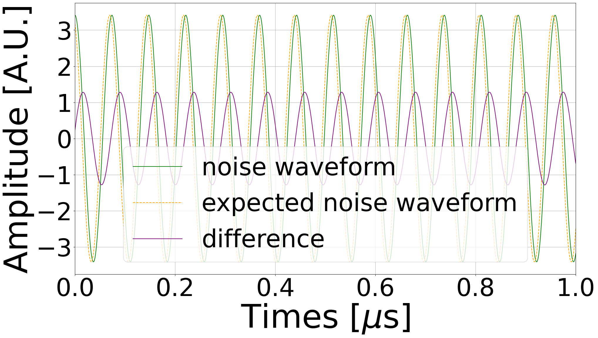
- Attempt two. Zeroing 64 magnitudes $\longrightarrow$ IFFTs $\longrightarrow$ subtracting the 64 waveforms $\longrightarrow$ FFTs $\longrightarrow$ average of the filtered spectra $\longrightarrow$ IFFT
  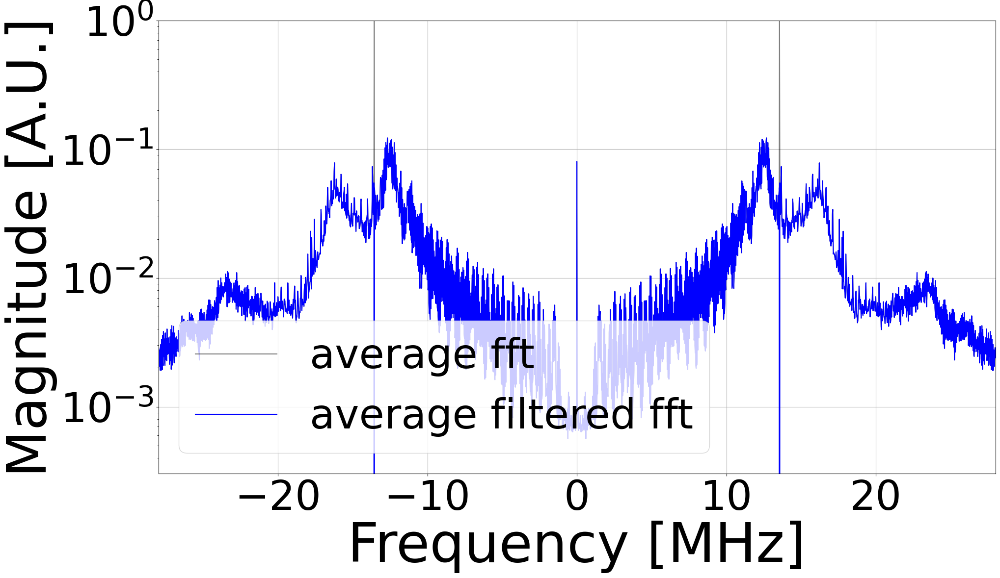
  The expected noise waveform has a phase equal to the average of the phases of that component before filtering.
  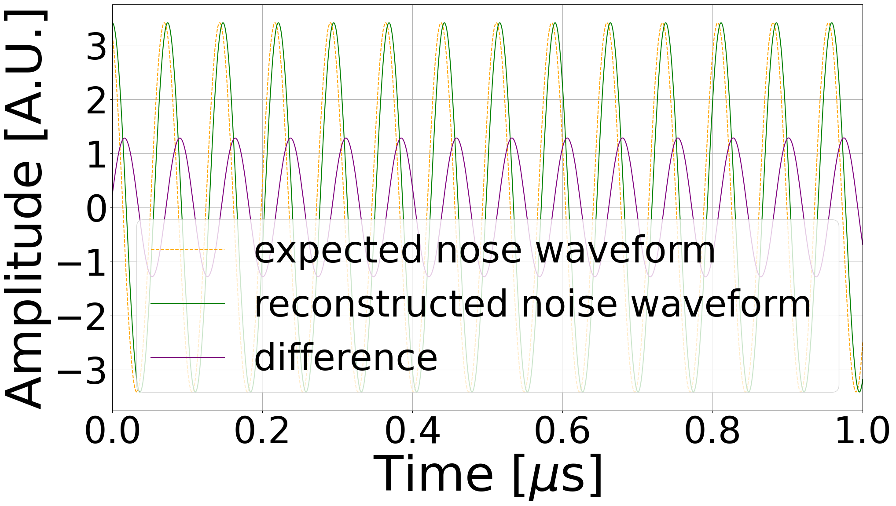
  The result obtained with this cumbersome method is not different from the one got from attempt one, in which we still averaged in frequency domain.
- Attempt three. Zeroing 64 magnitudes $\longrightarrow$ IFFTs $\longrightarrow$ average the noise waveforms
  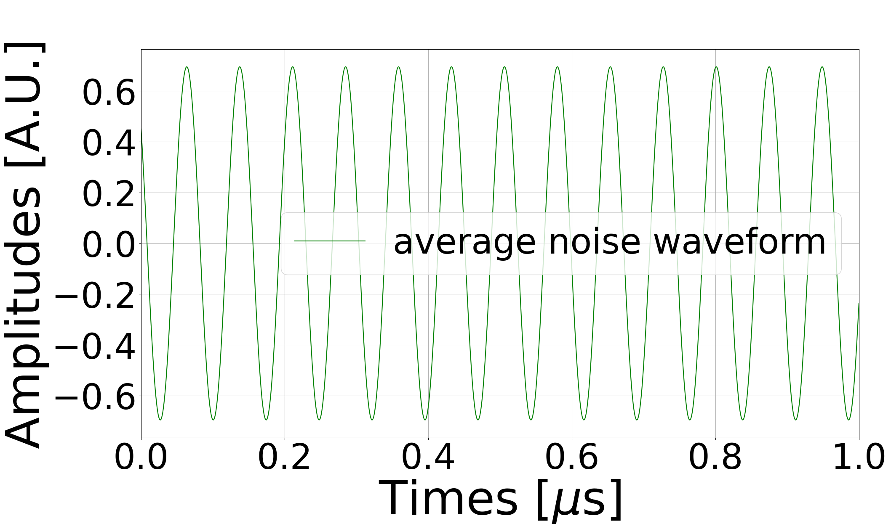
  The expected noise waveform has a phase equal to the average of the phases of that component before filtering.
  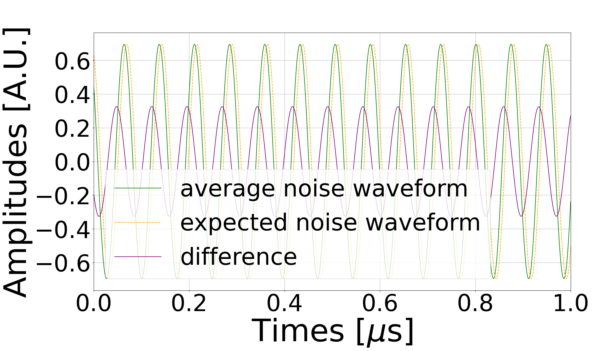
- Attempt four. Zeroing 64 magnitudes $\longrightarrow$ IFFTs $\longrightarrow$ average the noise waveforms
  
  The expected noise waveform has a phase equal to the phase of the target component from the reconstructed spectrum (IFFT of the average waveform).
  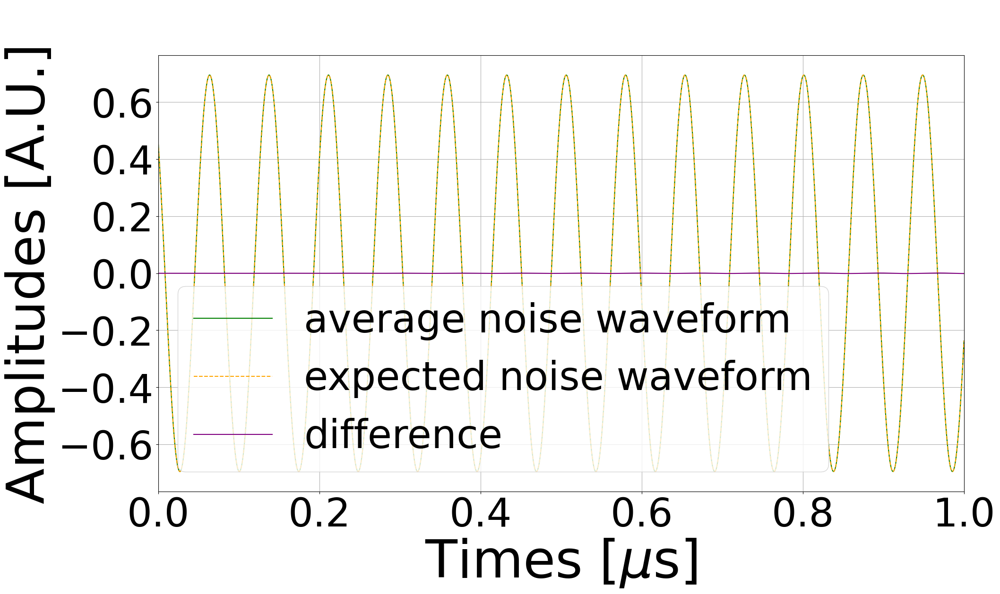
  ATTENTION: This attempt refers to an expected noise waveform with an incorrectly-retrieved phase. Therefore, even though the noise waveform obtained seems satisfactory, it is probably being compared to a non-existent component.
  Below is represented the comparison between the spread of the average of the phases and the phases of the reconstructed spectrum.
  
  This plot shows how the first method of retrieving the phase information reduces the influence of uncorrelated components, yielding a more accurate phase estimation.

None of the attempts has produces satisfactory results according to the testing technique adoperated.

> **Features of analyzed data:** These plots refer to a run dated 08082024 at 15:46, the antenna was connected to a low-pass filter. Settings: +-50 mV, 5 $\mu$s/div, 0-350 MHz.
