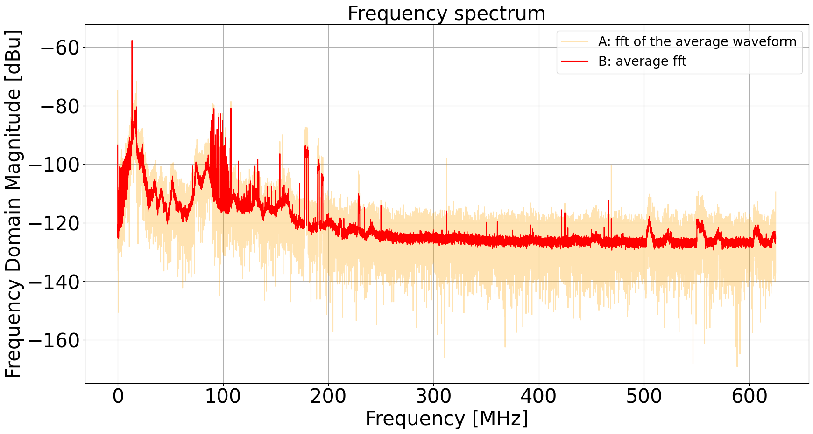

- First step: characterize the radio background of my office at DESY to gain necessary expertise to apply the same analysis at RNO-G data.
   The main goal is to identify the sources with dominant magnitude in the high-frequency domain.
- Second step: filter any identified source using the information on its signal type: frequency and phase.

There atre two types of sources, broad-spectrum sources and narrow-spectrum sources. The formers are naturally occurrent physical phenomenas and the latters are artificial physical phenomenas.
Background noise is dominated bu low-frequency, typically broad-spectrum signals that reach the heighest magnitudes detected.\
Since the purpose of the study are high-frequency signals, those represent an obstacle for amplitude resolution reachable by the instrumentation. Therefore high-pass filters will be employed to clear the waveform from unwanted signals.

# 1. Background characterization
The background waveform is a superimposition of multiple signals, each of them described by a frequency and a phase.\
* The Fourier Transform of a waveform discloses the frequency components of the signal.
* The output of the Fourier Transform is a set complex numbers, therefore the orientations of those numbers in the complex plane are the phase components of the signal.

How to compute a fourier transform of a waveform: Discrete Fourier Transforms in Python [FFT package](https://docs.scipy.org/doc/scipy/reference/fft.html#).\
    

The instrumentation provides the possibility to save a maximum of 64 waveforms. There are in principle two ways one can extract the DFT from this input.

## Method A
Computing the average of 64 waveforms $\longrightarrow$ FFT and phases of the average waveform.

Source code: [avg_wf_vs_avg_fft](avg_wf_VS_avg_fft-NOerrors.ipynb)

Source code: [avg_wf_vs_avg_phase](avg_wf_VS_avg_phase-NOerrors.ipynb)

## Method B
Computing separetly the FFT of each waveform $\longrightarrow$ average FFT and average phases.\
Note that the average FFT is calculated by averaging the absolute values of each outcome of rfft, but the phases must calculated before executing np.abs(Y), otherwise we would lose the phase information.

Source code: [avg_wf_vs_avg_fft](avg_wf_VS_avg_fft-NOerrors.ipynb)

Source code: [avg_wf_vs_avg_phase](avg_wf_VS_avg_phase-NOerrors.ipynb)

## Comparison A VS B

