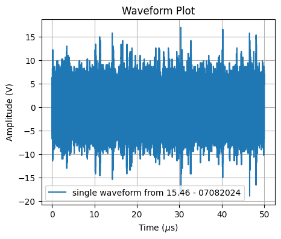

- First step: characterize the radio background of my office at DESY to gain necessary expertise to apply the same analysis at RNO-G data.
   The main goal is to identify the sources with dominant magnitude in the high-frequency domain.
- Second step: execute a spectral analysis on a dataset of multiple waveforms.
- Third step: filter any unwanted component using the information on its signal type: frequency and phase.

# 1. Background characterization
The background waveform is a superimposition of multiple sine waves, each of them described by a frequency and a phase.\
* The Fourier Transform of a waveform discloses the frequency components of the signal.
* The output of the Fourier transform is a set complex numbers, the angles associated to those numbers in the complex plane are the phases of the signal's components.

The directory [1.wf_fft](1.wf_fft) shows how to compute the Fourier transform of a waveform using the discrete Fourier transforms implemented in the Python [FFT package](https://docs.scipy.org/doc/scipy/reference/fft.html#).\

    
 
# 2. Spectral analysis of multiple waveforms
After assessing the feasibility of transiting from the time domain to the frequency domain and back, we notice that real signals need multiple data acquisitions for achieving the clarity necessary to execute any kind of analysis. Multiple waveforms consecutive in time are recorded both from the office antenna and from RNO-G antennas. In science when several data are provided a good approach in averaging them. The issue here is that combining those measurements will return different results if the average is done over time domain or over frequency domain. The directory [2.two_combination_methods](2.two_combination_methods) stores the codes, results and explainations for the comparison between the two methods.

# 3. Testing filtering algorithms
Since RNO-G is an highly sensitive experiment, an adequate level of precision is required to analyze their data. The filtering process requires deep knowledge of the background that is being manipulated and of the tools adoperated to manupulate it. Unfortunaltely this is not always the case since the most common filtering algorithms are as simple as defective. [3.filtering](3.filtering) lists the several attempts of implementing these basic angorithms to adapt them for an analysis of multiple waveforms. The first algorithm examinated consists in suppressing the unwanted component in frequency space, the filtered waveform in this case is the FFT of the filtered spectrum. The second algorithm implemented filters the noise in time domain by subtracting the noise waveform from the original one. The filtered waveform is the result of this subtraction. The noise waveform has been identified with the IFFT of the noise spectrum, that is, the original spectrum where all non-noisy components have been set to zero.  
