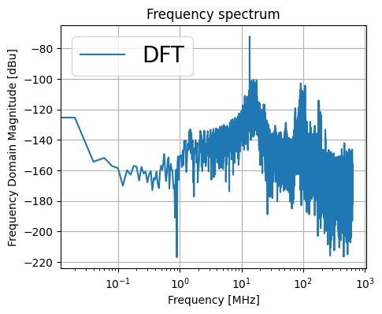

- First step: characterize the radio background of my office at DESY to gain necessary expertise to apply the same analysis at RNO-G data.
   The main goal is to identify the sources with dominant magnitude in the high-frequency domain.
- Second step: filter any identified source using the information on its signal type: frequency and phase.

# 1. Background characterization
The background waveform is a superimposition of multiple sine waves, each of them described by a frequency and a phase.\
* The Fourier Transform of a waveform discloses the frequency components of the signal.
* The output of the Fourier transform is a set complex numbers, the angles associated to those numbers in the complex plane are the phases of the signal's components.

How to compute the Fourier transform of a waveform: discrete Fourier transforms are implemented in the Python [FFT package](https://docs.scipy.org/doc/scipy/reference/fft.html#).\

    

The data acquisition system provided the possibility to save a maximum of 64 waveforms. There are in principle two ways one can extract the DFT from this input.

## Method A
Computing the average of 64 waveforms $\longrightarrow$ FFT and phases of the reconstructed spectrum.

Source code: [avg_wf_vs_avg_fft](avg_wf_VS_avg_fft-NOerrors.ipynb)

Source code: [avg_wf_vs_avg_phase](avg_wf_VS_avg_phase-NOerrors.ipynb) \
With this method you can see a chaotic phase composition in the averaged signal.

## Method B
Computing separetly the FFT of each waveform $\longrightarrow$ average FFT and average phases.\
Note that the average FFT is calculated by averaging the absolute values, but the phases must calculated before executing np.abs(Y), otherwise we would lose the phase information.

Source code: [avg_wf_vs_avg_fft](avg_wf_VS_avg_fft-NOerrors.ipynb)

Source code: [avg_wf_vs_avg_phase](avg_wf_VS_avg_phase-NOerrors.ipynb) \
With this method you can see a tendency towards an average phase of 0 degrees.

> **Naming convetions:** If the average is computed in time domain the average of the waveforms will be referred to as the average waveform, if the average is computed in frequency domain the average of the spectra will be referred to as the average FFT.
The term reconstructed refers to a waveform (or a spectrum) that is the inverse Fourier transform (or the Fourier transform) of an average in frequency (or time) domain.

## Comparison A VS B

Source code: [avg_wf_vs_avg_fft](avg_wf_VS_avg_fft-NOerrors.ipynb)

Source code: [avg_wf_vs_avg_phase](avg_wf_VS_avg_phase-NOerrors.ipynb)

